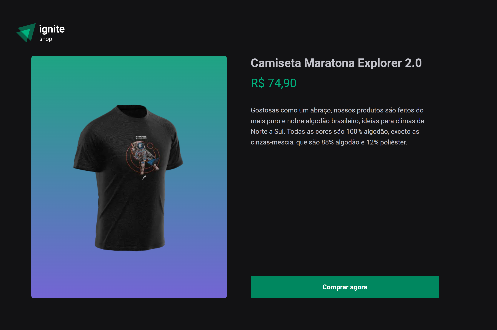

 

<h3 align="center">Online shop of T-shirts made with NextJS + Stripe.</h3>

- ACCESS ONLINE PROJECT [HERE](https://04-ignite-shop-nw91.vercel.app/)

---

<h2>Preview 🎥</h2>

---

<h2>Technologies  🛠</h2>

#### FrontEnd: `NextJS!`

- Axios
- React Icons
- Typescript
- Keen Slider
- Stripe

 
  
  
  
  
 

 

---

